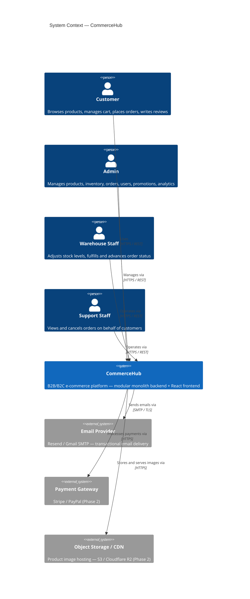
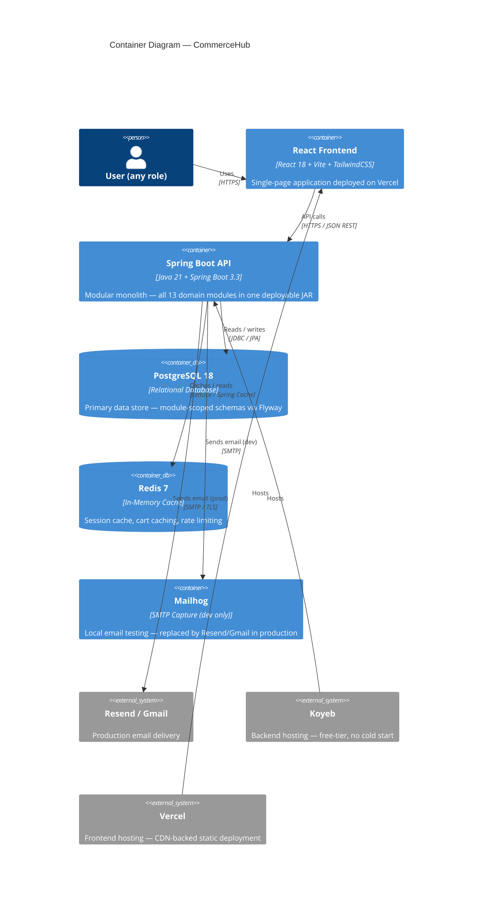
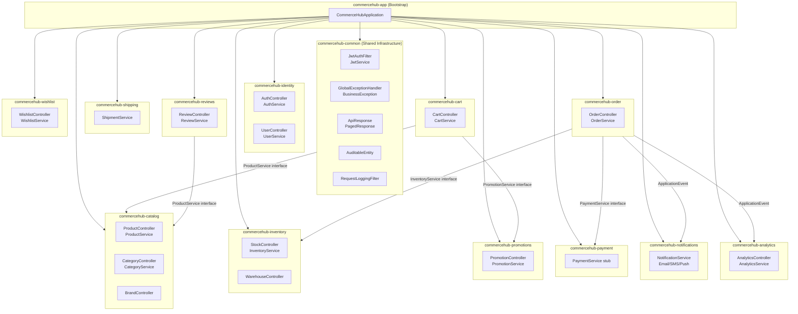
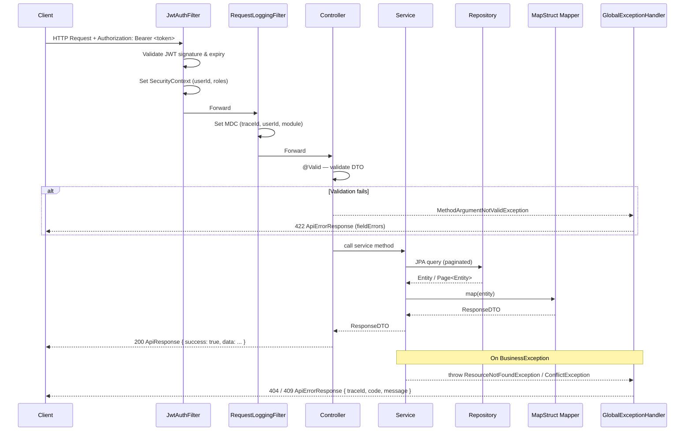
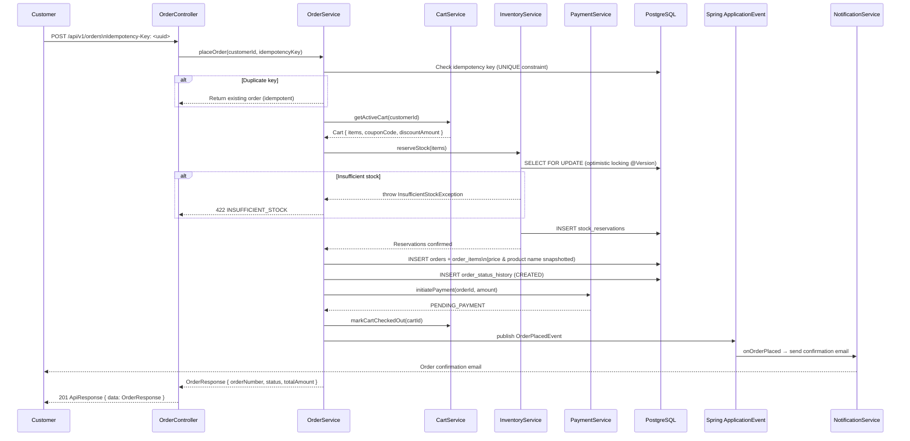
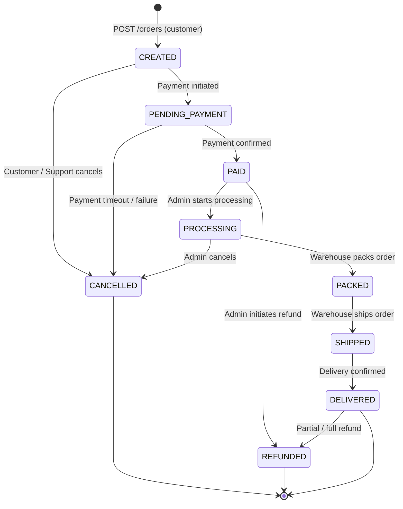
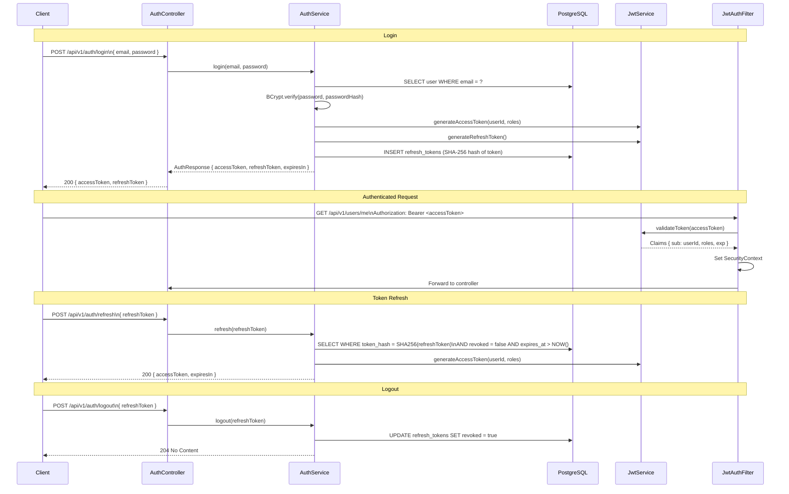
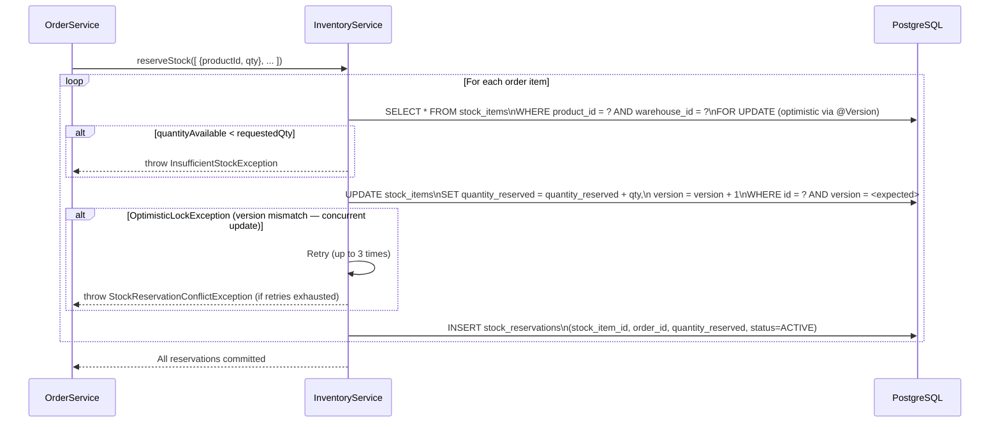
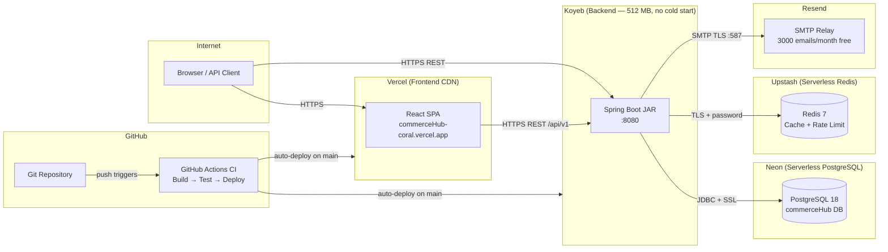

# Architecture Diagrams — CommerceHub

All diagrams are written in [Mermaid](https://mermaid.js.org/), which renders natively on GitHub, GitLab, and most modern documentation tools.

---

## 1. System Context

Who uses CommerceHub and how they interact with it at the highest level.

---

## 2. Container Diagram

The runtime components of CommerceHub and their relationships.

---

## 3. Module Architecture

How the 13 bounded-context modules are organized inside the Spring Boot application.

---

## 4. Request Lifecycle (Sequence)

A typical authenticated API call from the HTTP request to the response.

---

## 5. Order Placement Flow

End-to-end flow for placing an order, showing cross-module coordination.

---

## 6. Order Status Machine

All valid order status transitions.

---

## 7. Database Entity Relationship Diagram

Core entity relationships across all modules.

```mermaid
erDiagram
    users {
        UUID id PK
        VARCHAR email UK
        VARCHAR password_hash
        VARCHAR first_name
        VARCHAR last_name
        VARCHAR status
        TIMESTAMPTZ deleted_at
        TIMESTAMPTZ created_at
    }
    roles {
        BIGINT id PK
        VARCHAR name UK
    }
    user_roles {
        UUID user_id FK
        BIGINT role_id FK
    }
    addresses {
        UUID id PK
        UUID user_id FK
        VARCHAR label
        VARCHAR street_line1
        VARCHAR city
        CHAR country_code
        BOOLEAN is_default
    }
    categories {
        BIGINT id PK
        VARCHAR name UK
        VARCHAR slug UK
        BIGINT parent_id FK
    }
    brands {
        BIGINT id PK
        VARCHAR name UK
        VARCHAR slug UK
        VARCHAR logo_url
    }
    products {
        UUID id PK
        VARCHAR sku UK
        VARCHAR name
        NUMERIC price
        VARCHAR status
        BIGINT brand_id FK
        TIMESTAMPTZ deleted_at
    }
    product_categories {
        UUID product_id FK
        BIGINT category_id FK
    }
    product_images {
        UUID id PK
        UUID product_id FK
        VARCHAR url
        BOOLEAN is_primary
        INT sort_order
    }
    warehouses {
        UUID id PK
        VARCHAR name
        VARCHAR code UK
        BOOLEAN active
    }
    stock_items {
        UUID id PK
        UUID product_id FK
        UUID warehouse_id FK
        INT quantity_on_hand
        INT quantity_reserved
        INT low_stock_threshold
        BIGINT version
    }
    stock_reservations {
        UUID id PK
        UUID stock_item_id FK
        UUID order_id
        INT quantity_reserved
        VARCHAR status
    }
    stock_adjustments {
        UUID id PK
        UUID stock_item_id FK
        UUID adjusted_by FK
        INT quantity_delta
        VARCHAR reason
    }
    carts {
        UUID id PK
        UUID user_id FK
        VARCHAR status
        VARCHAR coupon_code
        NUMERIC discount_amount
    }
    cart_items {
        UUID id PK
        UUID cart_id FK
        UUID product_id FK
        INT quantity
        NUMERIC unit_price
    }
    orders {
        UUID id PK
        VARCHAR order_number UK
        UUID customer_id FK
        VARCHAR status
        NUMERIC subtotal
        NUMERIC discount_amount
        NUMERIC shipping_cost
        NUMERIC tax_amount
        NUMERIC total_amount
        VARCHAR applied_coupon
        VARCHAR idempotency_key UK
    }
    order_items {
        UUID id PK
        UUID order_id FK
        UUID product_id
        VARCHAR product_name
        VARCHAR sku
        INT quantity
        NUMERIC unit_price
        NUMERIC line_total
    }
    order_status_history {
        UUID id PK
        UUID order_id FK
        VARCHAR from_status
        VARCHAR to_status
        UUID changed_by FK
        TIMESTAMPTZ changed_at
    }
    reviews {
        UUID id PK
        UUID product_id FK
        UUID customer_id FK
        SMALLINT rating
        VARCHAR title
        TEXT body
        VARCHAR status
    }
    wishlist_items {
        UUID id PK
        UUID user_id FK
        UUID product_id FK
    }
    promotions {
        UUID id PK
        VARCHAR name
        VARCHAR type
        NUMERIC discount_value
        INT max_usage_count
        INT usage_count
        TIMESTAMPTZ start_date
        TIMESTAMPTZ end_date
        VARCHAR status
    }
    coupons {
        UUID id PK
        UUID promotion_id FK
        VARCHAR code UK
        INT max_uses
        INT current_uses
    }

    users ||--o{ user_roles : "has"
    roles ||--o{ user_roles : "assigned via"
    users ||--o{ addresses : "has"
    users ||--o| carts : "owns"
    users ||--o{ orders : "places"
    users ||--o{ reviews : "writes"
    users ||--o{ wishlist_items : "saves"

    products ||--o{ product_categories : "belongs to"
    categories ||--o{ product_categories : "contains"
    categories ||--o{ categories : "parent of"
    brands ||--o{ products : "makes"
    products ||--o{ product_images : "has"

    products ||--o{ stock_items : "tracked in"
    warehouses ||--o{ stock_items : "stores"
    stock_items ||--o{ stock_reservations : "reserved by"
    stock_items ||--o{ stock_adjustments : "adjusted via"

    carts ||--o{ cart_items : "contains"
    products ||--o{ cart_items : "added to"

    orders ||--o{ order_items : "contains"
    orders ||--o{ order_status_history : "tracks"

    products ||--o{ reviews : "reviewed by"
    products ||--o{ wishlist_items : "saved in"

    promotions ||--o{ coupons : "generates"
```

---

## 8. Authentication Flow (JWT)

Login, token usage, and refresh flow.

---

## 9. Inventory Reservation Flow

How stock is safely reserved during order placement using optimistic locking.

---

## 10. Deployment Architecture

Production deployment topology using free-tier cloud services.

---

> **Tip:** These diagrams render natively in GitHub's Markdown viewer.
> For local preview, use the [Mermaid Live Editor](https://mermaid.live) or the VS Code Mermaid Preview extension.
